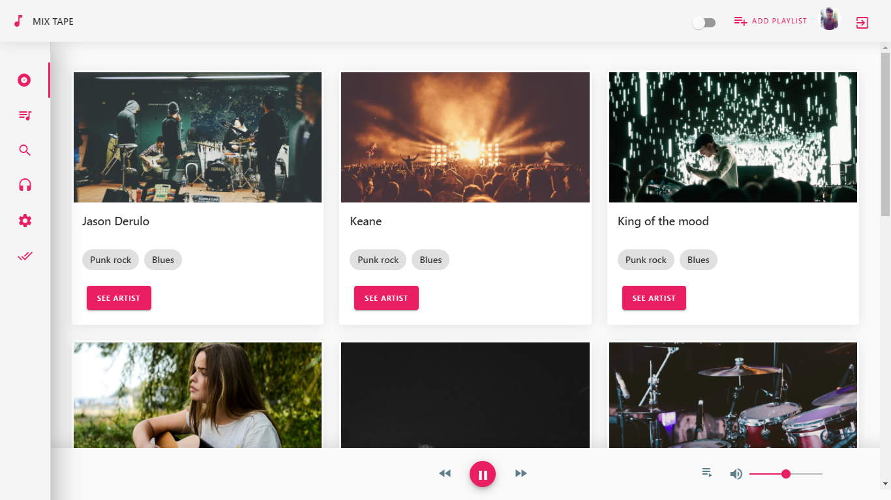
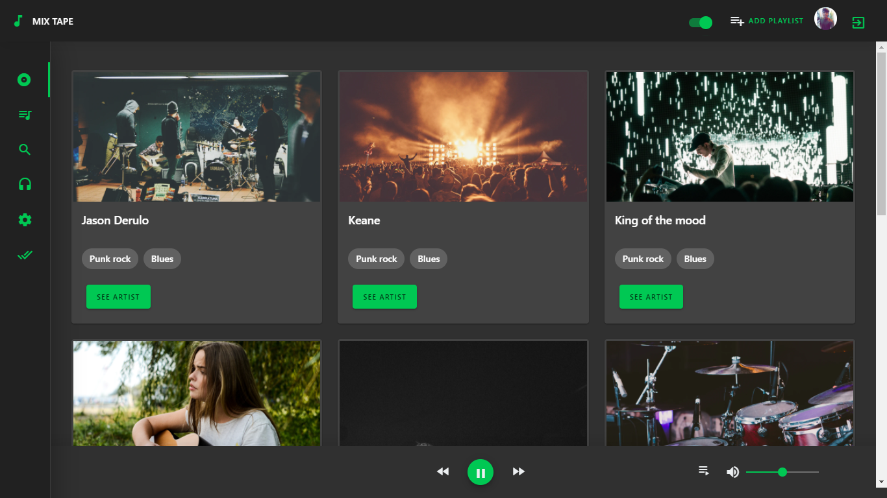
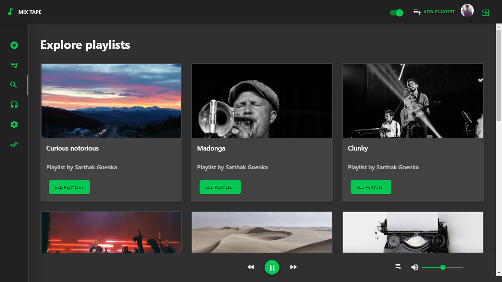
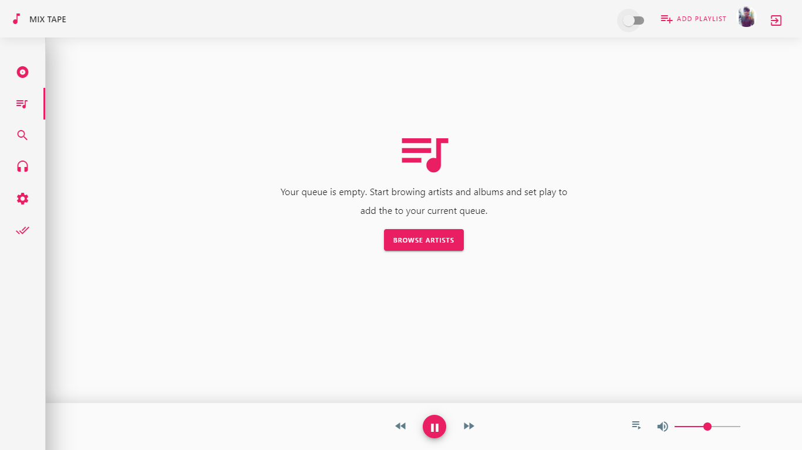
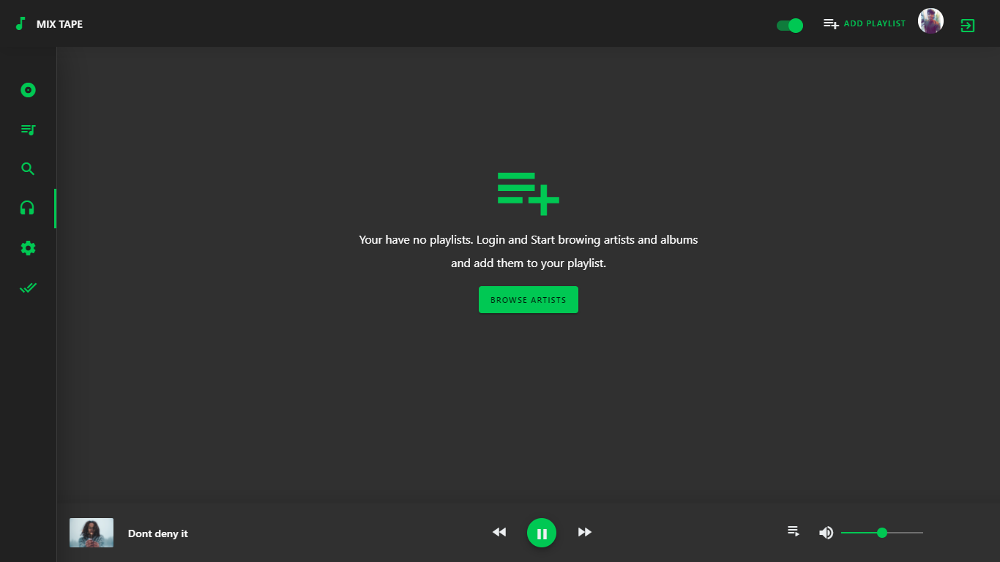

# AngularMixTape🎵

🎵A music app build using AngularJS using state management by NgRx and Material Design UI.

## Screenshots

</img>
</img>
</img>
</img>
</img>

## Features
- Material design
- Browse Songs, Albums, Artists
- Create and edit playlists
- Dark Theme Style with wallpaper as background
- Playing queue
- Play Controller is able to be opened everywhere

## Demo Link
Demo is lere :- [AngularMixTape](https://sangeet-87aa6.firebaseapp.com/)

